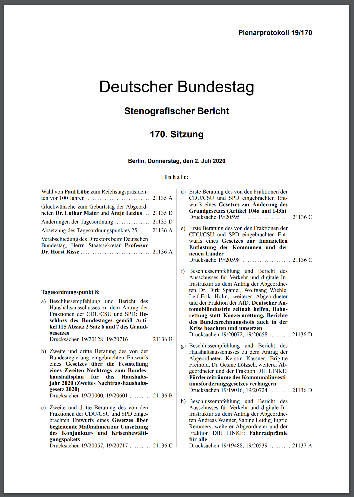
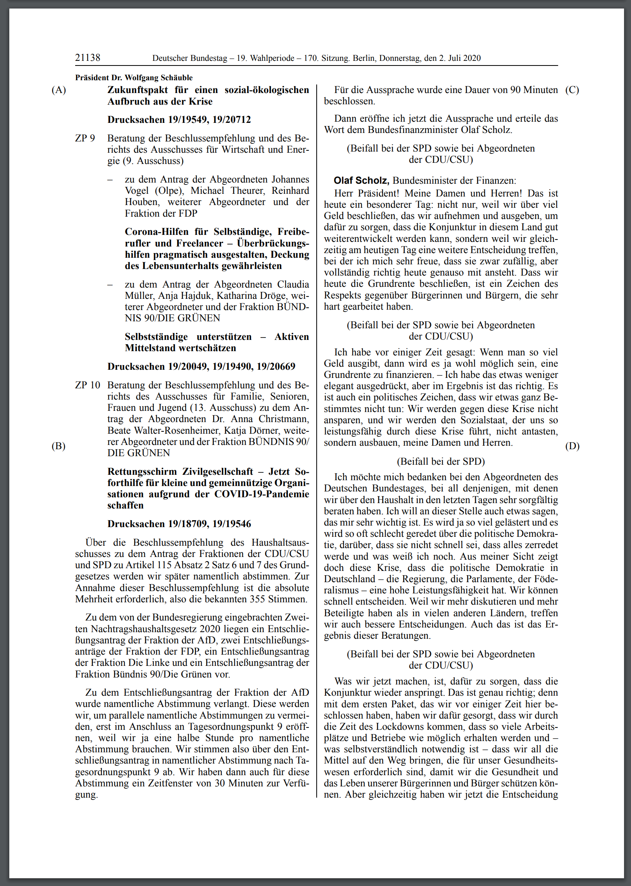
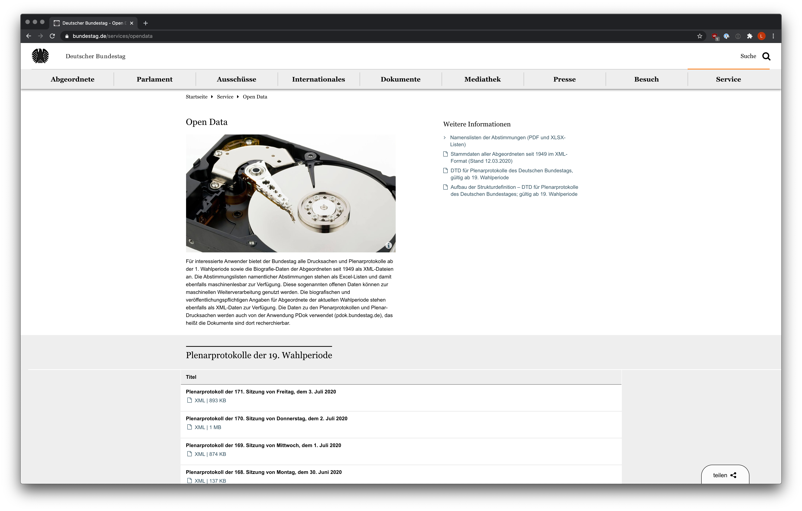

```{r, include = FALSE}
knitr::opts_chunk$set(
  collapse = TRUE,
  comment = "#>"
)
```


# Introduction

## Overview Open Data Bundestag

The plenary meetings of the German Bundestag are protocolled by a team of stenographs.
These protocols get published as .pdf, .txt, and thanks to the open data initiative of the Bundestag as a .xml file as well. 

{width=45%}
{width=45%}

{width=60%}


## Downloading the protocols

We start of by importing the package as usual and downloading the protocols from the website of the bundestag.

```{r}
library(dbtprotokoll)
```

```{r eval=FALSE, warning=FALSE, include=FALSE, results='hide'}
paths <- download_protocols()
```

Normaly it isn't necessary to touch the parameters base_url and registry_url, those seem to be fixed for the 19. election period. What we could change is the directory the protocols get saved in, but we leave the default value for now: a local directory named "protokolle". 

```{r eval=FALSE, include=FALSE}
print(paths[1:10])
```

A call to download_protocols returns a vector of paths to the downloaded files.

## Parsing the protocols

Let's inspect one of these protocol files using the package xml2:

```{r}
protocol <- xml2::read_xml('./protokolle/19001-data.xml')

protocol
```

It consists of a header section with some basic information about the plenary session and the protocol.
Under this are four child elements:

- vorspann
- sitzungsverlauf
- anlagen
- rednerliste

The package "dbtprotokoll" is able to parse information out of "sitzungsverlauf" and "rednerliste".

```{r}
print(xml2::xml_find_all(protocol, ".//rede")[[1]])
```

This is the structure of a "rede"-element which is a child of "sitzungsverlauf". It documents a speech hold by a member of the bundestag, moderation by the leader of the plenary-session (for example the president) and general remarks made by other members of the bundestag like applause or interjections. Other parts of the "sitzungsverlauf" are interesting as well but are very difficult to analyse without a linguistic background. Therefore we did not bother parsing them.

```{r}
print(xml2::xml_find_all(protocol, ".//rednerliste")[[1]])
```

The "rednerliste" element contains the details of every member of the bundestag who is mentioned in the protocol.

### Using dbtprotokoll to parse a single protocol

To parse a single protocol with dbtprotokoll, the function parse_protocol is used. 
Its arguments are a string for the file path and the optional "check_schema" argument. If check_schema is TRUE (its default value), the xml2-function "xml_validate" will be used to validate that the xml document given is indeed written in the correct xml schema. To check this, we downloaded the file "dbtplenarprotokolle-data.dtd" and converted it into an xsd file.
If the schema is correct (or check_schema is FALSE), the function will read the xml file given in the path-argument and start extracting information from the xml. It will then return a named list of four tibbles containing information about the plenary meeting:

```{r}
parsed_protocol <- parse_protocol("./protokolle/19001-data.xml")
print(parsed_protocol)
```

Let's look at the returned tibbles in detail.

1. **"speakers":** A tibble containing speaker ID, full name, party and possibly roles of every person that held a speech at this plenary meeting.
```{r}
print(parsed_protocol$speakers)
```

2. **"paragraphs":** A tibble containing all paragraphs from all speeches held at the plenary meeting. The individual speech ID and speaker ID of the speaker are also found in this tibble.
```{r}
print(parsed_protocol$paragraphs)
```

3. **"comments":** A tibble containing all comments made in all speeches as well as the speech ID of the speech the comment was made in. Comments in this case are not only interjections by other politicians, but also include applause, laughing and amusement within different partys.
```{r}
print(parsed_protocol$comments)
```

4. **"roles":** A tibble containing all roles members of the bundestag have. This is necessary because some speakers have multiple roles. We can get all roles back by joining these two tibbles. 
```{r}
print(parsed_protocol$comments)
```

### Parsing the complete dataset

Parsing the complete dataset can be easily achieved by using "parse_protocols" and specifying the range. This function will instanciate as many parallel parsers as your system offers to speed up the process. It returns the same tibble structure, but cleaned up. Duplicated rows within the speakers- and roles tibble get removed.

```{r}
parsed_protocols <- dbtprotokoll::parse_protocols(start = "19001-data.xml", end = "19010-data.xml")
print(parsed_protocols)
```

### Store and restore the dataset with save and load

The parsed data can be manipulated and handled with standard R-functions for example saving the data to and loading it from disk to avoid parsing it again. 
```{r}
save(parsed_protocols, file = "protocols.RData")

rm(parsed_protocols)
```

```{r}
load("./protocols.RData")

print(parsed_protocols)
```

## Running analysis

The data stored in the tibbles can be analysed like always. For nicer presentation of analyses, the dbtprotokoll package offers a variable called "party_colors". It is a named atomic vector of hexadecimal codes (saved as strings) of the partys' asigned colors.

```{r}
party_colors
```

### Run a simple analysis

Let's count the number of speakers:

```{r}
library(dplyr)
parsed_protocols$speakers %>% count()

```

### Run complex analysis

Here is a list of more complex questions we asked:

- [Reactions from the fractions](Reactions.html)
- [Word lenghts](WordLengths.html)
- [Usage of words depending on the fraction](WordOccurences.html)
